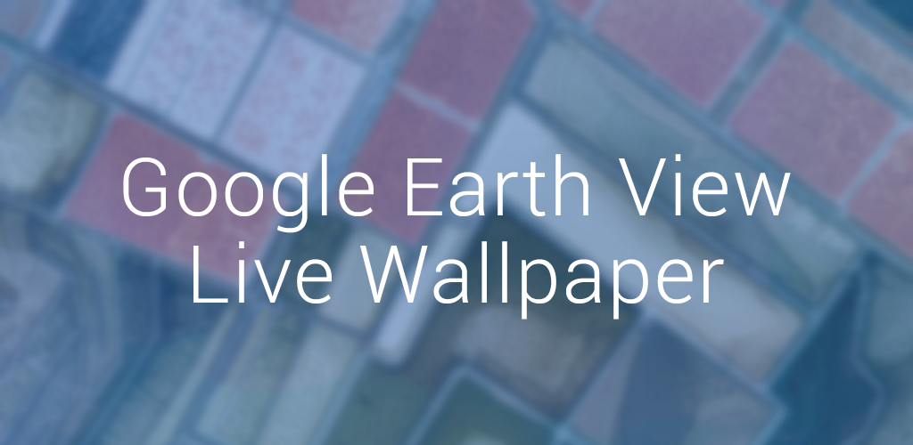
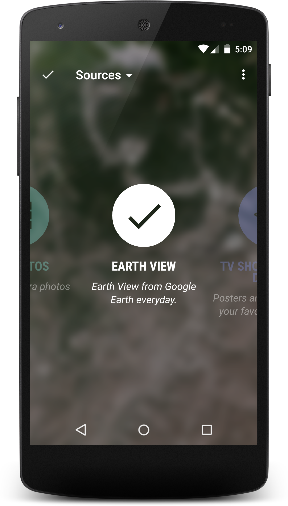

Muzei Earth View
================

[][1]

Installation
------------

[][1]

What
----

[][1]
[][1]

Earth View Wallpaper for [Muzei app](https://play.google.com/store/apps/details?id=net.nurik.roman.dashclock)
from [Roman Nurik](https://plus.google.com/+RomanNurik).

Earth View is a collection of the most striking and enigmatic landscapes available in Google Earth.
Display a beautiful image from Google Earth as your wallpaper every day with configurations.
- You can enable Wi-Fi only mode where the app only downloads the wallpapers only if the device is connected to Wi-Fi.
- You can change the interval between wallpaper changes.

Requires the Muzei Live Wallpaper made by Roman Nurik from http://get.muzei.co

Muzei is a live wallpaper that gently refreshes your home screen each day with famous works of art. It also recedes into the background, blurring and dimming artwork to keep your icons and widgets in the spotlight. Simply double touch the wallpaper or open the Muzei app to enjoy and explore the artwork in its full glory.

Instructions
------------

- Make sure that `Muzei App` is installed
- Click here: https://play.google.com/store/apps/details?id=net.nurik.roman.muzei
- or search for Muzei
- Open Muzei app
- Select `Customization` and then select `Earth View` as your source

License
-------

    Copyright (C) 2015 Said Tahsin Dane

    Licensed under the Apache License, Version 2.0 (the "License");
    you may not use this file except in compliance with the License.
    You may obtain a copy of the License at

       http://www.apache.org/licenses/LICENSE-2.0

    Unless required by applicable law or agreed to in writing, software
    distributed under the License is distributed on an "AS IS" BASIS,
    WITHOUT WARRANTIES OR CONDITIONS OF ANY KIND, either express or implied.
    See the License for the specific language governing permissions and
    limitations under the License.

[1]: https://play.google.com/store/apps/details?id=com.tasomaniac.muzei.earthview
